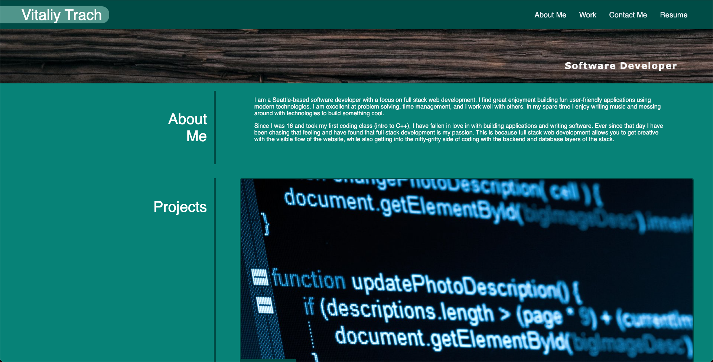
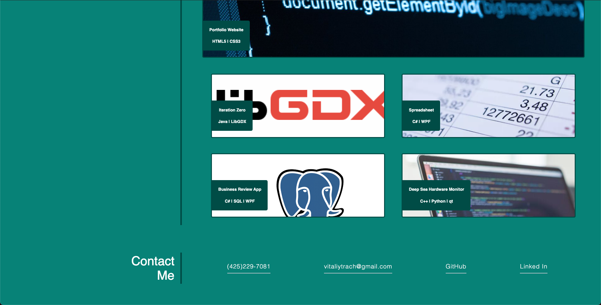

# Vitaliy Trach Portfolio Website

## Background

Over the years I have worked on multiple coding projects and since then haven't had a nice simple place to show all of them. This website is a one stop spot that shows my proudest works as will as gives information to contact me through email or social medias.

## Projects
 

### Iteration Zero

This project was an isometric style game I built using the LibGDX java game development framework. This game allowed the user to control a player that can roam around the world and interact with different types of entities. The game makes use of the Entity Component System architecture to allow the developer to add new features.

### Spreadsheet

This application features a spreadsheet similar to google sheets where the user can track data in spreadsheet cells and add formulas and other things for easy number tracking. The application was built using .NET's WPF framework.

### Business Review App

This application features a yelp-like app that allows a user to search business on a map, or by various filters, and check the reviews customers left. It was built using .NET's WPF framework and used PostgreSQL for the SQL database.

### Deep Sea Hardware Monitor

This application was an application built to be onboard a submarine. It read data that the various IoT devices onboard emitted and put them into nice readable charts for the submarine pilot to monitor. Built using the qt c++ application development framework.

## Deployment

Link to website: https://vitaliytrach.github.io/portfolio-1/

Link to source code: https://github.com/vitaliytrach/portfolio-1

## Screenshots of the website

### Top Half

### Bottom Half
